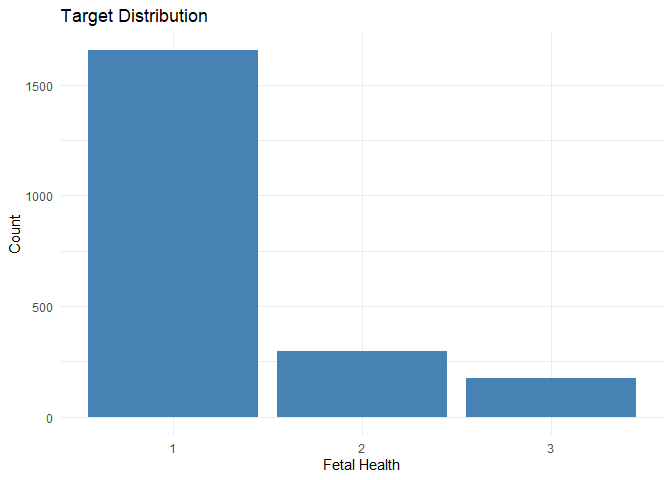
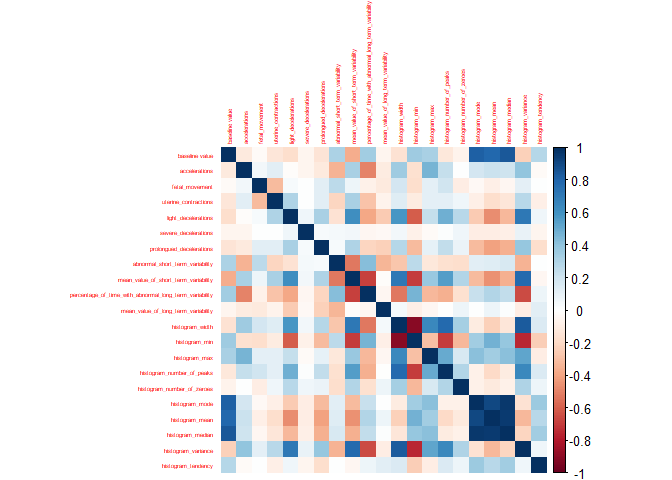
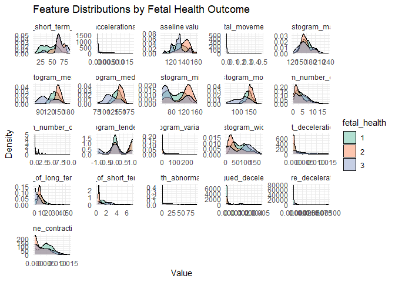
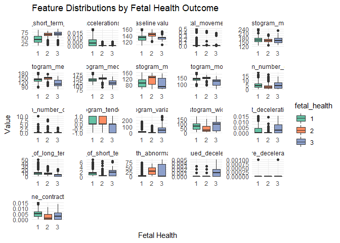
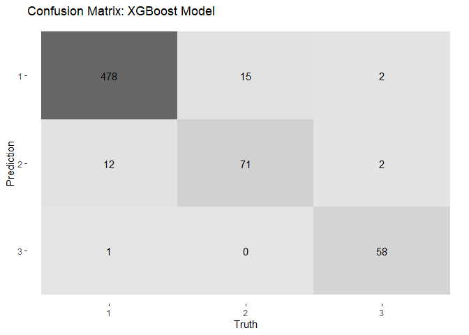
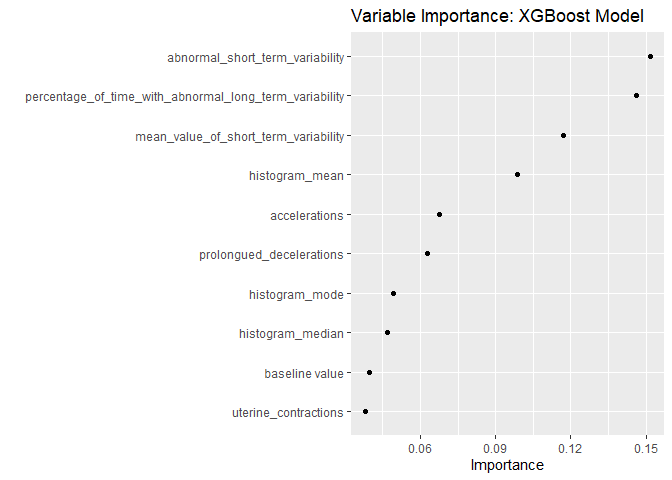
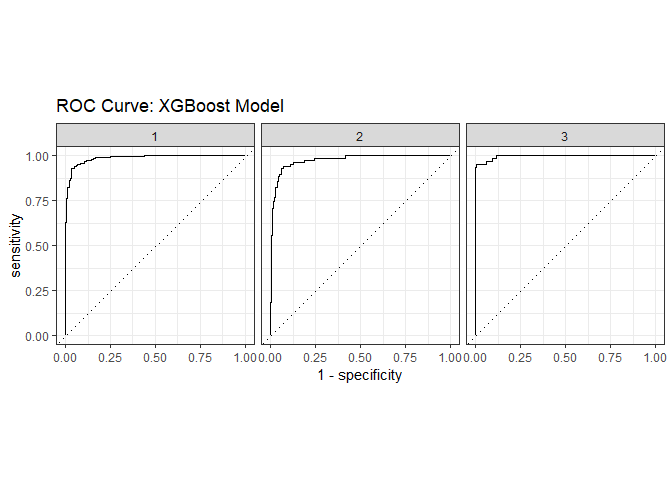

Fetal Health Classification
================
Islam Asal
March 07, 2022

``` r
knitr::opts_chunk$set(fig.path='Figs/')
```

# Load Necessary Packages

``` r
library(tidyverse)   # For data manipulation and visualization
```

``` r
library(tidymodels)  # For modeling
```
``` r
library(vip)         # For variable importance
```
``` r
library(corrplot)    # For correlation matrix visualization
```

``` r
library(here)
```
``` r
library(rio)
library(knitr)
opts_chunk$set(dev="png")
# For XGBoost model
```

# Load and Prepare the Data

``` r
# Load the data
df <- import(here('fetal_health.csv'))
# Convert the target variable to a factor for classification
df$fetal_health <- as.factor(df$fetal_health)
```

# Exploratory Data Analysis (EDA)

## Target Distribution

``` r
# Plot the distribution of the target variable
df %>%
  ggplot(aes(x = fetal_health)) +
  geom_bar(fill = 'steelblue') +
  labs(title = 'Target Distribution', x = 'Fetal Health', y = 'Count') +
  theme_minimal()
```

<!-- -->

## Correlation Matrix

``` r
# Calculate the correlation matrix (excluding the target variable)
correlation_matrix <- df %>%
  select(-fetal_health) %>%
  cor(method = "spearman")

# Adjust margins to fit the plot in the window
par(mar = c(1, 1, 1, 1))

# Plot the correlation matrix
corrplot(correlation_matrix, method = "color", tl.cex = 0.4)
```

<!-- -->

# Feature Distribution Against the Outcome

## Density Plots for Continuous Features

``` r
# Reshape data for easy plotting
df_long <- df %>%
  pivot_longer(-fetal_health, names_to = "features", values_to = "value")

# Plot density plots for each feature by fetal health
df_long %>%
  ggplot(aes(x = value, fill = fetal_health)) +
  geom_density(alpha = 0.5) +
  facet_wrap(~ features, scales = "free") +
  labs(title = "Feature Distributions by Fetal Health Outcome", x = "Value", y = "Density") +
  theme_minimal() +
  scale_fill_brewer(palette = "Set2")
```

<!-- -->

## Box Plots for Continuous Features

``` r
# Plot boxplots for each feature by fetal health
df_long %>%
  ggplot(aes(x = fetal_health, y = value, fill = fetal_health)) +
  geom_boxplot() +
  facet_wrap(~ features, scales = "free") +
  labs(title = "Feature Distributions by Fetal Health Outcome", x = "Fetal Health", y = "Value") +
  theme_minimal() +
  scale_fill_brewer(palette = "Set2")
```

<!-- -->

# Data Splitting

``` r
# Set seed for reproducibility
set.seed(142)

# Split data into training (70%) and testing (30%) sets
df_split <- initial_split(df, prop = 0.7, strata = fetal_health)
df_train <- training(df_split)
df_test <- testing(df_split)
```

# Preprocessing with `recipes`

``` r
# Create a recipe for data preprocessing
fetal_health_recipe <- recipe(fetal_health ~ ., data = df_train) %>%
  step_normalize(all_numeric_predictors())        

# Prepare the recipe
fetal_health_recipe <- fetal_health_recipe %>% prep()
```

# Model Specification

## XGBoost

``` r
# Define the XGBoost model with tuning
xgb_spec <- boost_tree(
  trees = 1000, 
  tree_depth = tune(), 
  learn_rate = tune(), 
  loss_reduction = tune(),
  sample_size = tune(), 
  mtry = tune()
) %>%
  set_engine("xgboost") %>%
  set_mode("classification")

# Create a workflow for XGBoost
xgb_wf <- workflow() %>%
  add_recipe(fetal_health_recipe) %>%
  add_model(xgb_spec)
```

# Model Tuning and Fitting

## Tuning XGBoost

``` r
# Set up cross-validation and tune the XGBoost model
set.seed(142)
xgb_res <- xgb_wf %>%
  tune_grid(
    resamples = vfold_cv(df_train, v = 5),
    grid = 10,
    metrics = metric_set(roc_auc)
  )
```

    ## i Creating pre-processing data to finalize unknown parameter: mtry

    ## Warning: package 'vctrs' was built under R version 4.1.3

``` r
# Select the best model based on ROC AUC
best_xgb <- xgb_res %>%
  select_best("roc_auc")

# Finalize the workflow with the best hyperparameters
final_xgb <- finalize_workflow(xgb_wf, best_xgb)

# Fit the final XGBoost model on the training data
final_xgb_fit <- final_xgb %>%
  fit(data = df_train)
```

    ## [14:46:24] WARNING: amalgamation/../src/learner.cc:1095: Starting in XGBoost 1.3.0, the default evaluation metric used with the objective 'multi:softprob' was changed from 'merror' to 'mlogloss'. Explicitly set eval_metric if you'd like to restore the old behavior.

# Model Evaluation

## XGBoost Evaluation

``` r
# Make predictions on the test set using XGBoost
xgb_predictions <- final_xgb_fit %>%
  predict(df_test) %>%
  bind_cols(df_test)

# Calculate evaluation metrics for XGBoost
xgb_metrics <- xgb_predictions %>%
  metrics(truth = fetal_health, estimate = .pred_class)

# Print the evaluation metrics for XGBoost
xgb_metrics
```

    ## # A tibble: 2 x 3
    ##   .metric  .estimator .estimate
    ##   <chr>    <chr>          <dbl>
    ## 1 accuracy multiclass     0.950
    ## 2 kap      multiclass     0.867

# Confusion Matrix with Plot

## XGBoost Confusion Matrix

``` r
# Create and plot the confusion matrix for XGBoost
xgb_conf_mat <- xgb_predictions %>%
  conf_mat(truth = fetal_health, estimate = .pred_class)

# Visualize the confusion matrix for XGBoost
xgb_conf_mat %>%
  autoplot(type = "heatmap") +
  labs(title = "Confusion Matrix: XGBoost Model")
```

<!-- -->

# Variable Importance

``` r
# Plot variable importance for the XGBoost model
final_xgb_fit %>%
  extract_fit_parsnip() %>%
  vip(geom = "point") +
  labs(title = "Variable Importance: XGBoost Model")
```

<!-- -->

# ROC Curve for Model Performance

## XGBoost ROC Curve

``` r
# Get predicted probabilities for XGBoost
xgb_prob_predictions <- final_xgb_fit %>%
  predict(df_test, type = "prob") %>%
  bind_cols(df_test)

# Calculate ROC curve for XGBoost
xgb_prob_predictions %>%
  roc_curve(truth = fetal_health, .pred_1:.pred_3) %>%  # Adjust according to your factor levels
  autoplot() +
  labs(title = "ROC Curve: XGBoost Model")
```

<!-- -->
